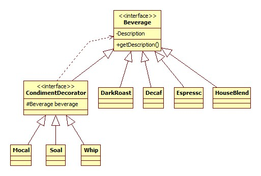
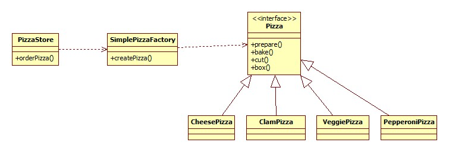
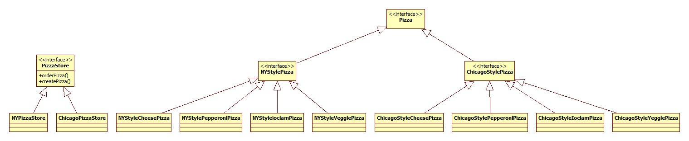
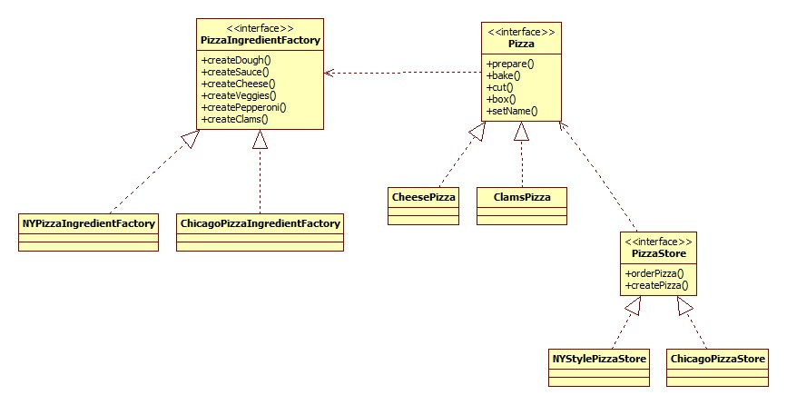
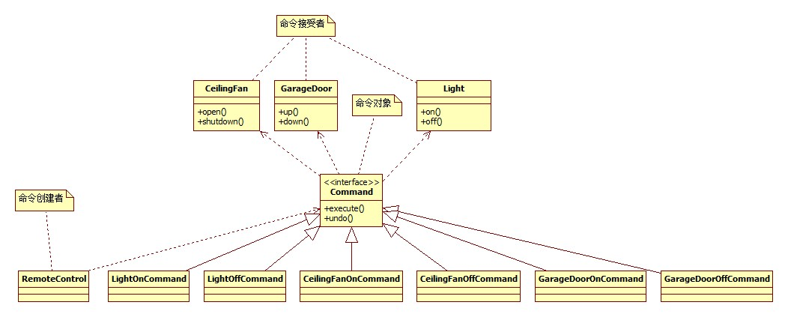
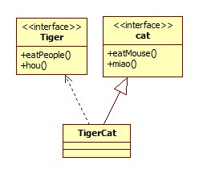
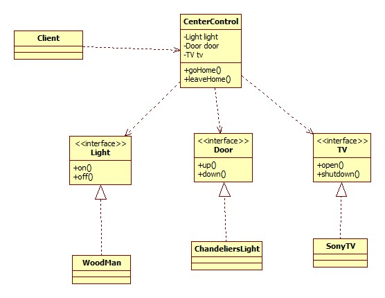

#设计模式

##设计模式定义

- 策略模式（Strategy Pattern）:定义了算法族，分别分装起来，让他们之间可以互相替换，此模式让算法独立于使用算法的客户。
- 观察者模式（Observer Pattern）:定义了对象之间的一对多依赖，这样一来当一个对象改变状态时，他的所有依赖者都会收到通知并更新。
- 装饰器模式(Decorator Pattern):动态地将职责附加到对象上，若要扩展功能，装饰者提供了比继承更好有弹性的替代方案   
- 工厂模式
    - 简单工厂模式（simplefactory pattern):其实简单工厂算不上是设计模式它只是简单地将创建对象的部分封装起来。 
    - 工厂方法模式（factorymethod pattern）：定义了一个创建对象的接口，但由子类决定要实例化的类时哪一个。工厂方法让类把实例化推迟到子类。
    - 抽象工厂模式(abstractfactory pattern):提供一个接口，用于创建相关或依赖对象的家族，而不需要明确指定具体类。
- 单例模式（Singleton pattern):确保一个类只有一个实例，并提供一个全局访问点。
- 命令模式（command pattern):将请求封装成对象，以便使用不同的请求、队列或者日志来参数化其他对象。命令模式也支持可撤销的操作。
- 适配器模式(adapter pattern）：将一个类的接口，转换成客户期望的另一个接口，适配器让原本几口不兼容的类可以合作无间。
- 外观模式:(facade pattern):提供一个统一的接口，用来访问子系统中的一群接口，外观定义了一个高层接口，让子系统更容易使用。

##设计原则

- 封装变化
- 多用组合，少用继承
- 针对接口编程
- 为了交互对象之间的松耦合设计而努力
- 类应该对扩展开放对修改关闭 
- 依赖倒置原则，要依赖抽象不要依赖具体类
- 最少知识原则：只和你的密友谈话。

##设计模式学习

###一、策略模式

*需求：*  
 
1. 需要创建一大批鸭子    
2. 这些鸭子形态，类型各异（例如玩具鸭子，绿头鸭子，红头鸭子，高科技鸭子...）   

--------    

*实现:*  

**demo1**
    
*说明：*   


- 通过继承的方式实现设计一个父类Duck
- 子类通过实现父类，来达到代码的复用

>按照上面的设计，如果需要鸭子有奔跑的动作就需要改变Duck类，那么这个动作会在所有继承了Duck的子类上面得到体现，但如果我们需要再加入一个木头鸭子呢？
小黄鸭不会奔跑，或许我们可以给出一个空的奔跑方法，但如果我们又加入了其他类型的鸭子呢？这些鸭子有的不会跑，有的不会叫，有的不会飞，那样我们每次实现
就要考虑要不要覆盖父类的方法！所以我们得出一个结论，为了复用代码而使用继承，有可能会给后期的维护带来巨大的困难！


**demo2**

*说明: *


- 将不同的功能通过接口分离出来
- 子类可以选择实现哪个接口

>上面的设计，刚开始看上去是很聪明的设计，但是由于java的接口是提供任何代码实现的，所以代码的复用性呢？这样每个子类都需要自己实现一遍接口规定的方法，
这样就造成，叫声千奇百怪，飞的乱七八糟，特色是有了，但这是你想要的吗?为同一个功能重复写代码！


**demo3** 
  
*说明:*    


- 将不同的行为从duck类中抽出成接口
- 针对行为接口提供多种具体的实现
- 通过组合的方式将行为组合到Duck类中
- 针对接口编程，将Duck类的行为和具体的行为实现解耦

>上面的设计，不但可以在创建对象的时候针对对对象的行为进行定义，在类运行期间也可以改变类的行为。这样做的好处是将不同的行为封装起来，类通过组合的方式将行为和
类组合起来，既解除了类和具体行为的耦合关系，也可以方便代码的复用，并且这种复用不只针对Duck类，例如我们需要实现一个模拟鸭子叫的装置，就可以将上述的Quackbehaciour
进行复用。

##二、观察者模式

*需求：*   

1. 我们有一个获取气象站更新信息的类 WeatherData
2. 现在需要实现几个布告板，能够在气象信息更新的时候同时更新布告板上的天气信息
3. 目前需要实现的布告板有 目前状况布告板，气象统计布告板，天气预报布告板，后期可能会加入更多布告板
4. WeatherData类更新的时候默认会调用measurementsChanged()方法
5. 完成以上需求，并且方便后期扩张更多的布告板

*实现：* 
  
**Demo1:** 
 


>上面的设计，首先我们定义一个Subject接口，一个Observer接口，分别代表主题和观察者。观察者观察主题。当观察者希望观察主题的时候，就去告诉主题，然后主题
通过registerObserver()方法将观察者加入接受通知的列表。当观察者不想收到主题的通知的时候，就告诉主题，然后主题通过removeOberver()方法将观察者从通知
列表中删除！其实主题内部维护了一个观察者列表，自由地添加和删除观察者，然后所有观察者都实现了Observer接口的update()方法，主题就可以通过调用注册的观察者
的update()方法来通知观察者了。以上就一个简单的观察者模式的实现。

##三、装饰器模式

*需求：*  
 
1. 现在有一家咖啡店，想要实现一个计算饮料交个的收银系统   
2. 所有饮料都继承自同一个类Beverage。    
3. 希望可以根据用户点的咖啡和加的配料，来计算咖啡的总价格。 


*实现：*



>上面的设计我们定义了一个装饰器对象的超类，CondimentDecorator,该类定义继承自Beverage并定义了一个指向Beverage的引用，所有的装饰器类都继承自CondimentDecorator
，装饰器类初始化需要传一个Beverage对象，然后装饰器类就可以通过一些方式扩展传进来的Beverage类。另外这里的继承是为了让客户可以透明地使用装饰器类就像使用原来的类一样
而不是为了扩展行为，真正的扩展行为是在运行时而不是在类中定义的。

##四、工厂模式   

**工厂方法模式**

*需求：*

1. 有一家披萨店，需要出售各种口味的披萨
2. 这些口味可能会根据销量有所修改，或者改进配方等等变化
3. 想出一种办法可以不用频繁修改披萨店的代码。

*实现：*



>利用上面的简单工厂模式，将创建Pizza对象和使用Pizza对象分离，让类不再依赖具体的实现而是依赖我们的工厂类。这样我们可以很轻松地复用创建Pizza对象的代码在其他地方
，同时再需要改需求的时候，可以直接修改工厂而不用动PizzaStore的代码

**工厂方法模式**

*需求：*

1. 现在我们需要开一个连锁的披萨店，由于连锁的范围非常广，可能需要纽约风味的披萨、意大利风味的披萨或者更多其他风味的披萨
2. 同时我们需要将制作工程规范化，制作Pizza的各个环节都规定好，不允许偷工减料
3. 并且允许子类有特殊需求，可以根据当地的情况对口味，配方，生产工艺上有一些改进

*实现：*



>上面的设计中，我们抽象出来PizzaStore创建者的抽象类，和Pizza产品的抽象类，关于创建，在Pizza中我们将生产过程规范化，然后将createPizza方法设置成为抽象方法，具体
的实现留到子类中去，这样我们即保证了产品的规范，又允许子类通过实现createPizza方法，来创建各种口味的Pizza,同时子类也可以覆盖父类在生产过程上的实现，针对当地的情况
对生产工艺有一些改进。

**抽象工厂模式**

*需求：*  
 
1. 现在披萨店要控制生产披萨所用的原料，防止部分披萨店随意用不好的原料。
2. 所有加工披萨的原料都必须从原料工厂获得。
3. 原料工厂提供各种原料的获取方法
4. 根据各地的情况，每个地区分别实现原料工厂，来建造自己地区的原料工厂
5. 披萨只知道生产所需的原料都从原料工厂来，对具体的哪个地区的原料工厂不感冒

*实现：*



>上面的设计中，可以通过抽象工厂来回一个产品家族，关键用户不用依赖具体的产品家族，只需要依赖产品家族的抽象类，抽象工厂方法可以把一群先关的产品集合起来。

**工厂方法和抽象工厂方法比较：**  
工厂方法提供一个接口，来创建一个产品，由每个自雷来决定实例化哪个具体类。    
抽象工厂方法提供一个抽象接口来创建一个产品家族。    
这两个模式都是将对象的创建过程封装起来，以便将代码从具体类解耦。

##单例模式
单例模式由于只有一个类就不画类图了，代理模式分为三种：

1. 饿汉模式
2. 懒汉模式
3. 双重检验懒汉模式


饿汉模式的例子：  
```
public class Singleton {

    private static Singleton singleton = new Singleton();

    private Singleton() {

    }

    public static Singleton getInstance() {
        return singleton;
    }


    public static void main(String[] args) {
        final Set<Singleton> singletons = new HashSet<Singleton>();
        for (int i = 0; i < 100000; i++) {
            new Thread(new Runnable() {
                public void run() {
                    singletons.add(Singleton.getInstance());
                }
            }).start();
        }

        try {
            Thread.sleep(5 * 60 * 1000);
        } catch (InterruptedException e) {
            e.printStackTrace();
        }
        System.out.println(singletons);
    }

}
```

懒汉模式例子： 

```
    public class Singleton {
    
        private static Singleton singleton = null;
    
        private Singleton() {
    
        }
    
        public static Singleton getInstance() {
            if (singleton == null) {
                try {
                    Thread.sleep(10);
                } catch (InterruptedException e) {
                    e.printStackTrace();
                }
    
                singleton = new Singleton();
    
            }
            return singleton;
    
        }
    
    
        public static void main(String[] args) {
            final Set<Singleton> singletons = new HashSet<Singleton>();
            for (int i = 0; i < 100000; i++) {
                new Thread(new Runnable() {
                    public void run() {
                        singletons.add(Singleton.getInstance());
                    }
                }).start();
            }
    
            try {
                Thread.sleep(5 * 60 * 1000);
            } catch (InterruptedException e) {
                e.printStackTrace();
            }
            System.out.println(singletons);
        }
    
    }
```

双重检验饿汉模式：  
 
```java
public class Singleton {

    private static volatile Singleton singleton = null;

    private Singleton() {

    }

    public static Singleton getInstance() {
        if (singleton == null) {
            try {
                Thread.sleep(10);
            } catch (InterruptedException e) {
                e.printStackTrace();
            }

            synorized(Singleton.class){
                if (singleton == null) {
                    singleton = new Singleton();
                }
            }


        }
        return singleton;

    }


    public static void main(String[] args) {
        final Set<Singleton> singletons = new HashSet<Singleton>();
        for (int i = 0; i < 100000; i++) {
            new Thread(new Runnable() {
                public void run() {
                    singletons.add(Singleton.getInstance());
                }
            }).start();
        }

        try {
            Thread.sleep(5 * 60 * 1000);
        } catch (InterruptedException e) {
            e.printStackTrace();
        }
        System.out.println(singletons);
    }

}
```

>饿汉模式是最简单的单例模式,它类出初始化的是就创建对象并赋值给类的静态变量，优点是简单、没有第一次使用惩罚。缺点就是，有时候一个类的初始化会非常浪费资源，并且
有可能在整个程序中，我们都没有使用这个类，这会造成资源上的浪费。
懒汉模式是将对象的初始化延迟到使用的时候，但是带来了一个问题，在并发情况下，会导致严重的并发问题。
双重检验懒汉模式，既保证对象的延迟初始化，又解决了并发问题，并且性能上也很好。


##五、命令模式

*需求：*

1. 我们需要实现一个遥控器多功能遥控器    
2. 这个遥控器有7个插槽，可以通过插入不同厂家的芯片来控制不同厂家的设备   
3. 这些不同的厂家会提供调用设备的方法    
4. 由于厂家的不同，设备的不同所以设备的调用各式各样 
5. 我们需要我们的设备可以调用各个厂家的设备，并且对于未来可能会有更多厂家接入需要提供良好的扩展性  

*设计：*



>通过上面你的命令模式，我们抽象出命令的发起者，命令，和命令的接受者三个角色，命令的请求者和命令的执行者是完全解耦的关系，命令的请求者不需要知道命令是不需要知道
是由哪个执行者执行的，而命令的执行者也不需要是谁发起的命令。后期的扩展，只需要实现相应的命令，将命令交给请求者调用就可以了通过这种模式，可以实现更丰富的功能例如
，记录操作日志，系统崩溃重新执行命令。任务队列等操作。

##六、适配器模式

*需求：*

1. 现在有play方法，必须要一只猫才能配合演出。
2. 有一只老虎想扮成猫去演出
3. 将老虎扮成猫吧

*设计：*



>适配器模式主要是解决让一个类转换为期望的接口。

##七、外观模式

*需求：*

1. 有一个人想回家直接就开门开灯看电视，然后离开家就关电视，关灯，关门    
2. 如果一个一个操作这些电器的接口太麻烦了
3. 请简化这个人的操作

*设计：*



>外观模式的主要作用就是简化方法的调用。