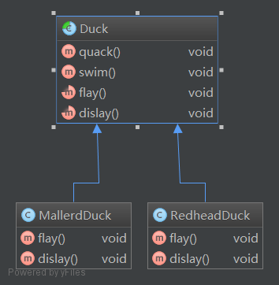
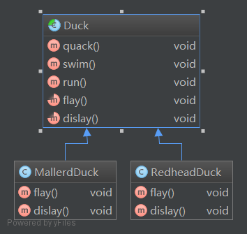
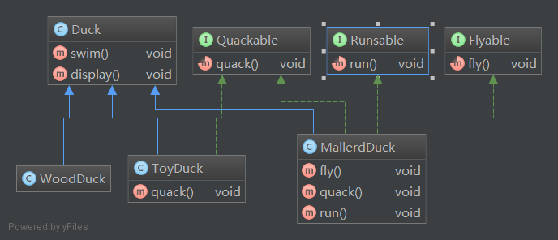
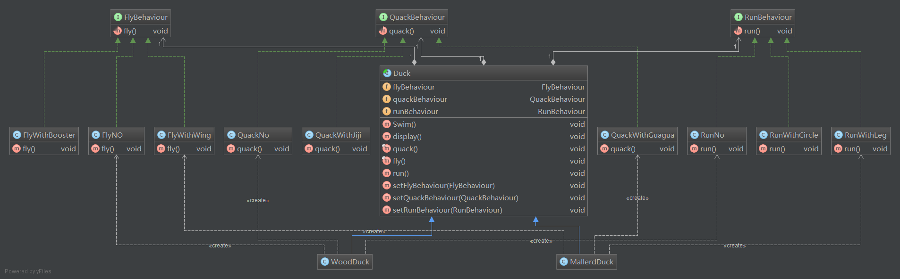
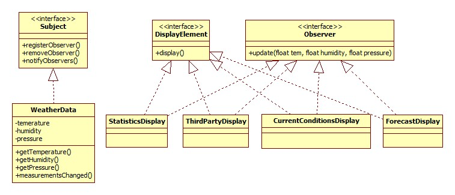

#设计模式
##设计模式定义
- 策略模式（Strategy Pattern）:定义了算法族，分别分装起来，让他们之间可以互相替换，此模式让算法独立于使用算法的客户。
- 观察者模式（Observer Pattern）:定义了对象之间的一对多依赖，这样一来当一个对象改变状态时，他的所有依赖者都会收到通知并更新。

##设计原则
- 封装变化
- 多用组合，少用继承
- 针对接口编程
- 为了交互对象之间的松耦合设计而努力

##设计模式学习

###一、策略模式
*需求：*   
1. 需要创建一大批鸭子    
2. 这些鸭子形态，类型各异（例如玩具鸭子，绿头鸭子，红头鸭子，高科技鸭子...）   

--------    

*实现:*  
**demo1**    
*说明：*   

- 通过继承的方式实现设计一个父类Duck
- 子类通过实现父类，来达到代码的复用

>按照上面的设计，如果需要鸭子有奔跑的动作就需要改变Duck类，那么这个动作会在所有继承了Duck的子类上面得到体现，但如果我们需要再加入一个木头鸭子呢？
小黄鸭不会奔跑，或许我们可以给出一个空的奔跑方法，但如果我们又加入了其他类型的鸭子呢？这些鸭子有的不会跑，有的不会叫，有的不会飞，那样我们每次实现
就要考虑要不要覆盖父类的方法！所以我们得出一个结论，为了复用代码而使用继承，有可能会给后期的维护带来巨大的困难！

**demo2**
*说明: *

- 将不同的功能通过接口分离出来
- 子类可以选择实现哪个接口

>上面的设计，刚开始看上去是很聪明的设计，但是由于java的接口是提供任何代码实现的，所以代码的复用性呢？这样每个子类都需要自己实现一遍接口规定的方法，
这样就造成，叫声千奇百怪，飞的乱七八糟，特色是有了，但这是你想要的吗?为同一个功能重复写代码！

**demo3**   
*说明:*    

- 将不同的行为从duck类中抽出成接口
- 针对行为接口提供多种具体的实现
- 通过组合的方式将行为组合到Duck类中
- 针对接口编程，将Duck类的行为和具体的行为实现解耦

>上面的设计，不但可以在创建对象的时候针对对对象的行为进行定义，在类运行期间也可以改变类的行为。这样做的好处是将不同的行为封装起来，类通过组合的方式将行为和
类组合起来，既解除了类和具体行为的耦合关系，也可以方便代码的复用，并且这种复用不只针对Duck类，例如我们需要实现一个模拟鸭子叫的装置，就可以将上述的Quackbehaciour
进行复用。

##二、观察者模式
*需求：*   
1. 我们有一个获取气象站更新信息的类 WeatherData
2. 现在需要实现几个布告板，能够在气象信息更新的时候同时更新布告板上的天气信息
3. 目前需要实现的布告板有 目前状况布告板，气象统计布告板，天气预报布告板，后期可能会加入更多布告板
4. WeatherData类更新的时候默认会调用measurementsChanged()方法
5. 完成以上需求，并且方便后期扩张更多的布告板

*实现：*   
**Demo1:**  

>上面的设计，首先我们定义一个Subject接口，一个Observer接口，分别代表主题和观察者。观察者观察主题。当观察者希望观察主题的时候，就去告诉主题，然后主题
通过registerObserver()方法将观察者加入接受通知的列表。当观察者不想收到主题的通知的时候，就告诉主题，然后主题通过removeOberver()方法将观察者从通知
列表中删除！其实主题内部维护了一个观察者列表，自由地添加和删除观察者，然后所有观察者都实现了Observer接口的update()方法，主题就可以通过调用注册的观察者
的update()方法来通知观察者了。以上就一个简单的观察者模式的实现。
